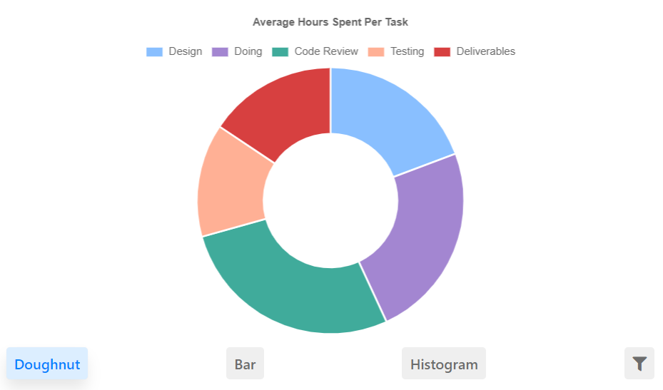
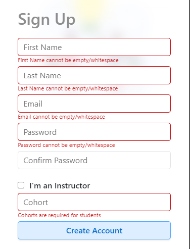

# User Guide
This document will guide the user to operate the Timesheet Tracker application within the ASP.NET Core application. Installation instructions and guides are provided within README.md repository on GitHub. The objectives of this guide are to operate Timesheet Tracker and to test the application using Arrange, Act, and Assert concept.

## Startup
Following instructions provided in the README.md, debug the Timesheet Tracked application within Visual Studio Community. It may take a couple of minutes for the application to start due to the npm installations dependencies. However, this only will run once when the application first starts. 

## Create Account
The figure shows the application homepage, in this page, the user can sign-in or create an account. 
1. To create an account, click “Create an account”.
2. There are two options to create an account based on roles, Instructors or Student.
3. When the creation of an account is a success, the user will be redirected to the homepage. 

| Homepage  | Sign Up | Instructor Sign Up  | Student Sign Up |
| ------------- | ------------- | ------------- | ------------- |
|  |  |  |  |

The **person** table as shown in the database.

## Sign In
After an account was created, the user can sign in based on the email and password sign up. The user will be redirected to pages depending on the role, Instructor or Student. 

## Instructor
The instructor can view list of projects created and assigned to student, charts, update account, create project and sign out. 

### Charts
There are three charts available for instructor to view.
- Doughnut chart calculates the average hours per project type or assignment name, eg. PHP API Assignment.
- The bar chart compares the maximum and minimum hours spent per project, eg. PHP API Assignment. The average bar allows the instructor to compare the differences between minimum and maximum values against the average student population. 
- This histogram chart allows the instructor to analyze the difficulty of their assignment. A good assignment should have symmetric shape. Skewing left or skewing right could indicate that the assignment is either too difficult or too easy. 

| Doughnut  | Bar | Histogram |
| ------------- | ------------- | ------------- |
|   |   |  |

This is an example from [Mike Yi](https://chartio.com/learn/charts/histogram-complete-guide/) indicating the variety of histogram shapes.

### Create Project

The figures below, show the fields required to be entered to create a project, eg. JavaScript DOM Assignment that is due on October 22, 2020 at 9:00 am. The instructor will have a choice to either assign the project to a student based or to a cohort. A message will return if the project is succesfully created. 

| Assign to a Student  | Assign to a Cohort | Success Message |
| ------------- | ------------- | ------------- |
|   |   |  |

The successful creation of *JavaScript DOM Assignment* in the **project** table as shown in the database.

### Update Account
The instructor can update their name, password, and email on their account as shown below:

| Update Account Field | Update Account Success Message |
| --- | --- |
|  |  |

The **person** table update as shown in database update.

 
## Student
The student can view list of projects that were assigned to them. Student can update hours for their project, update account, and sign out. 

### Update Hours
Student is able to update the hours and track the hours accumulated. Bar chart display will help student evaluate the hours accumulated for the type of task. Additionally, student is able to mark the project as completed and archive the project using delete project button. The figures below show the input fields and chart available for student.

| Update Hours Field  | Update Success | Bar Chart |
| ------------- | ------------- | ------------- |
|   |   |  |

### Update Account
Updating account format is similar to instructor as shown [above](Testing_Plan#update-account). 

# Testing Plan
The User Guide above has provided steps to successfully execute create, update, read, and delete actions in the applications. Therefore the testing plan below will show integration tests that will evaluate features of Timesheet Tracker. 

## Sign Up

### Arrange
There are three potential inputs identified for Sign Up feature:
- Null: *whitespace of empty*
- Format for name: *St3v3 R0g3rs*
- Format for email: *captainamerica.email.com*
- Cannot sign up with email already recorded in database: *gamora@guardians.com*
- Password format is length less than 6 characters

### Act
Select either instructor or cohort number to sign up and click "Create Account".

### Assert
| Cannot be null | Wrong name and password format | Wrong email format | Cannot signup with email recorded in database |
| --- | --- | --- | --- |
|  |  |  |  |

## Sign In

### Arrange
There are four potential inputs identified for Sign In feature:
- Null: *whitespace or empty*
- Format: *batman*
- Email not recorded in the database: *hulk@marvel.com*
- Incorrect password input

### Act
Click "Go" button to act. 

### Assert
| Cannot be null | Wrong format | Email not in database | Incorrect password |
| --- | --- | --- | --- |
|  |  |  |  |

## Create Project

### Arrange
There are two potential inputs identified for Create Project feature:
- Null: *whitespace or empty*
- Due date cannot be in the past: *18/10/2020*

### Act
Select either individual assignment or cohort, then click "Create Project".

### Assert

| Cannot be null | Due date cannot be in the past |
| --- | --- |
|  |  |

## Update Account

### Arrange

There are two potential inputs identified for Update Account feature:
- Null as shown in First Name field: *whitespace or empty*
- Wrong format for name as shown in Last Name field: *St4rk*

### Arct

Fill in the fields, select a student or cohort and click "Save Changes".

