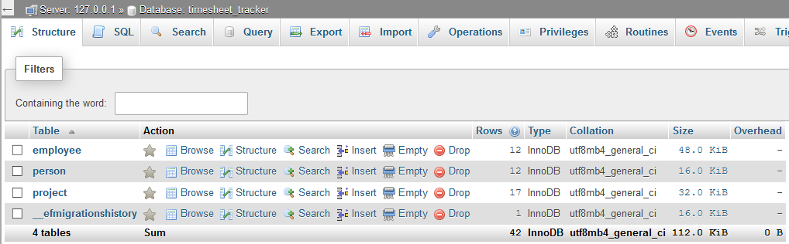

# Timesheet Tracker
[](https://www.repostatus.org/#active)

Jia and Osa from Input/Output submitted a [proposal](Planning/Design/ProposalforCapstoneProject.pdf) on September 30, 2020, to develop a Timesheet Tracker application that will replace the current format of [4.1] Master TECHCareers Timesheet Tracker (Master Timesheet). Master Timesheet was created using the Google Sheet platform and was released on July 15, 2020.  Since the release of the Master Timesheet, it has been inconvenient for students to use as it requires initial training, students to search their tabs and dates to enter their hours in specified columns. Additionally, instructors have difficulties tracking hours submitted by students and to analyze which student requires the most help based on hours submitted for a project. Timesheet Tracker will simplify timesheet submission for students and analyses for instructors by using a full-stack web application. 

## Prerequisites
- Timesheet Tracker requires [Visual Studio 2019](https://visualstudio.microsoft.com/downloads/) (VS 2019) and [ASP.NET Core 3.1](https://docs.microsoft.com/en-us/aspnet/core/introduction-to-aspnet-core?view=aspnetcore-3.1)
- This application uses [ReactJS.NET](https://docs.microsoft.com/en-us/aspnet/core/client-side/spa/react?view=aspnetcore-3.1&tabs=visual-studio) on ASP.NET Core and requires a few packages installation through [NuGet](https://docs.microsoft.com/en-us/nuget/what-is-nuget)
- [Entity Framework (EF) Core](https://docs.microsoft.com/en-us/ef/core/) is used in this application to perform data access against the [MySQL](https://dev.mysql.com/doc/refman/5.7/en/) database ([MariaDB](https://mariadb.org/)) and server ([Apache](https://httpd.apache.org/))
- This application requires the use of [Code First Migrations](https://docs.microsoft.com/en-us/ef/core/managing-schemas/migrations/?tabs=dotnet-core-cli) using EF in .NET Core to set up databases with dummy data
- This application requires a fundamental knowledge of [SQL](https://dev.mysql.com/doc/refman/5.7/en/) Syntax
- Developers tools such as [XAMPP](https://www.apachefriends.org/index.html) and [Postman](https://www.postman.com/) are recommended to engage, test, and use this application

## Installation
Within [Git](https://git-scm.com/) run these commands
```bash
$ git clone https://github.com/TECHCareers-by-Manpower/capstone-project-input-output.git
$ cd capstone-project-input-output
$ devenv start
```
It is not necessary to install packages and libraries after cloning the project, however depending on computer and software, at times packages need to installed manually. If you have encountered issues running this application you may proceed with the instructions below:


Installations of Entity Framework Core can be done either through [NuGet Package Manager for Solution...](https://docs.microsoft.com/en-us/nuget/consume-packages/install-use-packages-visual-studio) or through Visual Studio 2019 [NuGet Package Manager Console](https://docs.microsoft.com/en-us/ef/core/get-started/install/) (Package Manager), check for `Program.cs` in the file directory, within the same directory, run these commands
```bash
PM> dotnet add package Microsoft.EntityFrameworkCore.Design
PM> dotnet add package Microsoft.EntityFrameworkCore.SqlServer
PM> dotnet add package Pomelo.EntityFrameworkCore.MySql
PM> dotnet add package Microsoft.AspNetCore.Authentication.JwtBearer
PM> dotnet add package Microsoft.AspNetCore.SpaServices
PM> dotnet add package System.IdentityModel.Tokens.Jwt
````

Installations of packages relating to ReactJS.NET libraries can be done through the Package Manager by running these [commands](https://docs.microsoft.com/en-us/aspnet/core/client-side/spa/react?view=aspnetcore-3.1&tabs=visual-studio)
```bash
PM> cd ClientApp
PM> npm install
PM> npm install axios
PM> npm install react-chartjs-2
PM> npm install redux
````

To establish a database (within MariaDB) with pre-populated dummy data requires the execution of Code First Migrations. Run these commands to initiate migration within the `Program.cs` file directory
```bash
PM> dotnet ef add migrations StartUp
PM> dotnet ef database update
```

If there are any errors that occur during the migrations, kindly refer to the [EF Core tools reference](https://docs.microsoft.com/en-us/ef/core/miscellaneous/cli/dotnet) to troubleshoot. The server should be populated with the database named **timesheet_tracker** as shown below:



## Usage

Once the installations of Timesheet Tracker has been completed without any issues, you may start the application following these steps: 
1. Start the server, in our case it is through XAMPP developer tools
2. Within Visual Studio 2019, select *Timesheet_Tracker* project and Start Debugging (F5)
3. A browser should pop-up after it has completed building and compiling
4. You may choose to interact with the pages and test it using Postman

## Testing/Instructions


## Project Management 
This project was completed using [Kanban](https://en.wikipedia.org/wiki/Kanban) scheduling system and [Trello](https://trello.com/en) application was used to assist our scheduling. Here is the link, [Capstone Project](https://trello.com/b/5xoeCihL/capstone-project) to our Kanban board for Input/Output team. 

## Contributors
- Jia Then
  - [GitHub](https://github.com/jia-von)
  - [LinkedIn](https://www.linkedin.com/in/jia-then-780/)

- Osa Aimola
  - [GitHub](https://github.com/osaimola)
  - [Website](https://osaimola.com)

## Acknowledgement
Timesheet Tracker is part of a Capstone Project issued by TECHCareers for students to create a primary portfolio from this TECHCareers Full-Stack Software Developer Program. This project will help students to develop a professional level quality portfolio piece with the guidance from TECHCareers instructors. We would like to say thank you to [TECHCareers](http://www.techcareers.ca), [University of Alberta](https://www.ualberta.ca/information-services-and-technology/index.html), and Cohort 4.1 Students for teaching and sharing their experiences with us. 

## License

[GNU General Public License v3.0](LICENSE.txt)

## References
- [4.1-react-redux-to-do-app](https://github.com/TECHCareers-by-Manpower/4.1-react-redux-to-do-app)
- [4.1-ReactAPI by TECHCareers](https://github.com/TECHCareers-by-Manpower/4.1-ReactAPI)
- [ASP.NET Core 3.1 - Simple API for Authentication, Registration and User Management by Jason Watmore](https://jasonwatmore.com/post/2019/10/14/aspnet-core-3-simple-api-for-authentication-registration-and-user-management)
- [ASP.NET Core 3 and React by Carl Rippon](https://github.com/PacktPublishing/ASP.NET-Core-3-and-React)
- [Basic writing and formatting syntax by GitHub](https://docs.github.com/en/free-pro-team@latest/github/writing-on-github/basic-writing-and-formatting-syntax#lists)
- [Code Repository Badges by dwyl](https://github.com/dwyl/repo-badges)
- [Database design basics by Microsoft](https://support.microsoft.com/en-us/office/database-design-basics-eb2159cf-1e30-401a-8084-bd4f9c9ca1f5)
- [Diagram Software by draw.io](https://drawio-app.com)
- [How to use chart.js to create charts in React by Edpresso Team](https://www.educative.io/edpresso/how-to-use-chartjs-to-create-charts-in-react)
- [How to write a kickass README by James Scott](https://dev.to/scottydocs/how-to-write-a-kickass-readme-5af9)
- [How I Write SQL, Part 1: Naming Conventions by Launch by Lunch](https://launchbylunch.com/posts/2014/Feb/16/sql-naming-conventions/)
- [How to Make Asynchronous Calls in Redux Without Middlewares by Velotio Technologies](https://medium.com/velotio-perspectives/how-to-make-asynchronous-calls-in-redux-without-middlewares-cbf7181020b2)
- [HTTP request methods by Mozilla](https://developer.mozilla.org/en-US/docs/Web/HTTP/Methods)
- [Role Based Authorization Tutorial with Example API by Jason Watmore](https://jasonwatmore.com/post/2019/10/16/aspnet-core-3-role-based-authorization-tutorial-with-example-api#authenticate-model-cs)
- [README.md IDE by Dillinger](https://dillinger.io/)
- [Simple API for Authentication, Registration and User Management by Jason Watmore](https://jasonwatmore.com/post/2019/10/14/aspnet-core-3-simple-api-for-authentication-registration-and-user-management)
- [Tutorial: Create a complex data model - ASP.NET MVC with EF Core](https://docs.microsoft.com/en-us/aspnet/core/data/ef-mvc/complex-data-model?view=aspnetcore-3.1)
- [Wireframing in Figma by Figma](https://www.figma.com)